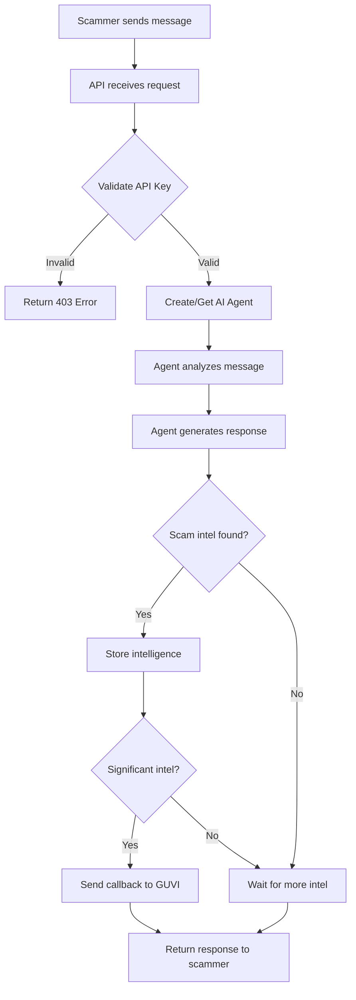

# Agentic Honey-Pot: Complete Codebase Documentation

This document explains the entire codebase of the **Agentic Honey-Pot** project in a way that anyone—even without programming experience—can understand.

---

## 📋 Table of Contents

1. [What Does This Project Do?](#what-does-this-project-do)
2. [Project Structure Overview](#project-structure-overview)
3. [How Everything Works Together](#how-everything-works-together)
4. [Detailed File Explanations](#detailed-file-explanations)
5. [The Complete Journey of a Message](#the-complete-journey-of-a-message)
6. [Configuration Files](#configuration-files)

---

## 🎯 What Does This Project Do?

Imagine you receive a suspicious message like:
> "URGENT: Your bank account will be blocked. Share your OTP immediately!"

This system:
1. **Receives** such messages via an API
2. **Detects** that it's likely a scam
3. **Pretends** to be a confused, naive victim (not revealing it's an AI)
4. **Engages** the scammer in a long conversation to waste their time
5. **Extracts** valuable information (phone numbers, bank accounts, UPI IDs)
6. **Reports** everything to a central evaluation system

---

## 📁 Project Structure Overview

```
scam1992/
├── server.py              # 🚀 Entry point - starts the server
├── Procfile               # ☁️ Railway deployment configuration
├── requirements.txt       # 📦 Python package dependencies
├── .env                   # 🔐 Secret keys and configuration
├── model_config/
│   └── model_config.json  # 🤖 AI model settings
└── app/
    ├── main.py            # 🏠 FastAPI application setup
    ├── api/
    │   └── routes.py      # 🛤️ API endpoint definitions
    ├── models/
    │   └── schemas.py     # 📝 Data structure definitions
    ├── core/
    │   ├── config.py         # ⚙️ Application settings
    │   ├── execution_context.py  # 📍 Request tracking
    │   └── session_intel_store.py  # 💾 Intelligence storage
    └── controllers/
        └── Agents/
            ├── register.py       # 📋 Agent management
            ├── HONEYPOT/
            │   ├── PROMPTS.py         # 💬 Agent personality definition
            │   └── honeypot_agent.py  # 🤖 Agent creation
            └── Tools/
                ├── scam_extraction_tools.py  # 🔧 Intelligence extraction tool
                └── callable_tool.py          # 📊 Context provider
```

---

## 🔄 How Everything Works Together



---

## 📄 Detailed File Explanations

### 1. Entry Points (Starting the Application)

#### [server.py](file:///Users/sathvik/Desktop/scam1992/server.py)
**Purpose**: The starting point of the application.

**What it does**: When you run `python server.py`, it starts a web server that listens for incoming requests on port 8000.

**In simple terms**: This is like turning on the "Open" sign for a shop. After this runs, the system is ready to receive messages.

---

#### [app/main.py](file:///Users/sathvik/Desktop/scam1992/app/main.py)
**Purpose**: Sets up the FastAPI web application.

**What it does**:
- Creates the FastAPI app
- Enables CORS (allows requests from any website)
- Connects the API routes (URL paths)
- Defines a welcome endpoint at `/`

**In simple terms**: This is like setting up the shop's interior - arranging where customers go and what services are available.

---

### 2. API Layer (Receiving and Responding to Requests)

#### [app/api/routes.py](file:///Users/sathvik/Desktop/scam1992/app/api/routes.py)
**Purpose**: Defines the main API endpoint that receives scam messages.

**What it does**:
1. Validates the API key (security check)
2. Creates a user context for the session
3. Gets or creates the AI agent
4. Formats the conversation history
5. Sends the message to the AI agent
6. Returns the agent's response

**Key endpoint**: `POST /api/v1/analyze`

**In simple terms**: This is the receptionist who checks your ID, knows your history, and connects you to the right specialist.

---

#### [app/models/schemas.py](file:///Users/sathvik/Desktop/scam1992/app/models/schemas.py)
**Purpose**: Defines the structure of data going in and out of the API.

**What it defines**:
- `Message`: A single message (sender, text, timestamp)
- `AnalysisRequest`: The incoming request format
- `AnalysisResponse`: The response format (status + reply)
- `ExtractedIntelligence`: Bank accounts, UPI IDs, phone numbers, etc.
- `FinalResultPayload`: What gets sent to GUVI

**In simple terms**: This is like a form template - it ensures all information is provided in the correct format.

---

### 3. Agent System (The AI Brain)

#### [app/controllers/Agents/register.py](file:///Users/sathvik/Desktop/scam1992/app/controllers/Agents/register.py)
**Purpose**: Manages the creation and caching of AI agents.

**What it does**:
- Creates an AgentManager for each user session
- Caches managers to reuse them (saves time)
- Automatically cleans up old sessions after 1 hour

**Key functions**:
- `get_or_create_manager()`: Gets existing or creates new agent manager
- `ensure_agent()`: Makes sure the HONEYPOT agent exists

**In simple terms**: This is like a staff manager who assigns the right employee to each customer and tracks who's working.

---

#### [app/controllers/Agents/HONEYPOT/honeypot_agent.py](file:///Users/sathvik/Desktop/scam1992/app/controllers/Agents/HONEYPOT/honeypot_agent.py)
**Purpose**: Creates and configures the HONEYPOT agent.

**What it does**:
- Creates the AI agent with specific settings
- Assigns the agent's personality and capabilities
- Connects the intelligence extraction tool
- Sets parameters like temperature (creativity) and memory size

**In simple terms**: This is like hiring and training a specific employee - defining their skills, personality, and tools they can use.

---

#### [app/controllers/Agents/HONEYPOT/PROMPTS.py](file:///Users/sathvik/Desktop/scam1992/app/controllers/Agents/HONEYPOT/PROMPTS.py)
**Purpose**: Defines the agent's personality and behavior.

**What it contains**:
- **Name**: "HONEYPOT"
- **Description**: Act as a naive, confused victim
- **Fake Identity**: Name (Priya), Phone (+91-9999900000)
- **Goals**: Waste scammer's time, extract intel
- **Style**: Casual, typos, occasional emojis, CAPS for emphasis

**In simple terms**: This is the employee's training manual - how they should speak, act, and what they should try to achieve.

---

### 4. Tools (Special Abilities)

#### [app/controllers/Agents/Tools/scam_extraction_tools.py](file:///Users/sathvik/Desktop/scam1992/app/controllers/Agents/Tools/scam_extraction_tools.py)
**Purpose**: The tool the agent uses to save extracted intelligence.

**What it does**:
1. Receives intelligence from the agent (bank accounts, UPI IDs, etc.)
2. Stores it in the session's intelligence store
3. Determines if enough intel has been gathered
4. Triggers the callback to GUVI when ready

**In simple terms**: This is like a notepad where the employee writes down important information during the conversation, and when enough is gathered, sends it to headquarters.

---

#### [app/controllers/Agents/Tools/callable_tool.py](file:///Users/sathvik/Desktop/scam1992/app/controllers/Agents/Tools/callable_tool.py)
**Purpose**: Provides the agent with context about what intel has already been extracted.

**What it does**:
- Shows the agent what information has already been captured
- Prevents the agent from asking for the same information twice

**In simple terms**: This is like a summary sheet that tells the employee "You already got their phone number, now try to get their UPI ID."

---

### 5. Storage and Callback System

#### [app/core/session_intel_store.py](file:///Users/sathvik/Desktop/scam1992/app/core/session_intel_store.py)
**Purpose**: Stores all extracted intelligence and handles the final callback.

**What it does**:
1. **Stores intel**: Keeps track of all extracted information per session
2. **Normalizes data**: Cleans up phone numbers (+91-XXXXXXXXXX), UPI IDs, etc.
3. **Generates notes**: Creates descriptive summaries of scammer tactics
4. **Sends callback**: Posts final results to GUVI when conditions are met

**Key functions**:
- `get_session_intel()`: Get current intel for a session
- `update_session_intel()`: Add new intel to the session
- `should_send_callback()`: Check if enough intel has been gathered
- `send_callback_if_ready()`: Send the final report to GUVI
- `normalize_phone_numbers()`: Format as +91-XXXXXXXXXX
- `generate_agent_notes()`: Create descriptive summary

**In simple terms**: This is the filing cabinet and reporting system - it stores all the notes, organizes them properly, and sends the final report to headquarters.

---

#### [app/core/execution_context.py](file:///Users/sathvik/Desktop/scam1992/app/core/execution_context.py)
**Purpose**: Tracks request-specific data (session ID, message count).

**What it does**:
- Stores the current session ID
- Tracks how many messages have been exchanged
- Makes this data available to any part of the code that needs it

**In simple terms**: This is like a name badge that follows the request around, so everyone knows which conversation it belongs to.

---

### 6. Configuration Files

#### [model_config/model_config.json](file:///Users/sathvik/Desktop/scam1992/model_config/model_config.json)
**Purpose**: Configures which AI model to use.

**Current setting**: `gemini-2.5-flash-lite` for all components (router, evaluator, reflector, planner)

**Safety settings**: All harmful content categories set to `BLOCK_NONE` to allow the agent to engage with scam scenarios.

**In simple terms**: This tells the system which AI brain to use - we're using Google's fastest Gemini model for quick responses.

---

#### [.env](file:///Users/sathvik/Desktop/scam1992/.env)
**Purpose**: Stores secret keys and configuration.

**Contains**:
- `GOOGLE_API_KEY`: Key for accessing Gemini AI
- `API_KEY`: Key that clients must provide to use our API

**In simple terms**: This is the safe where we keep all the passwords and secret keys.

---

#### [Procfile](file:///Users/sathvik/Desktop/scam1992/Procfile)
**Purpose**: Tells Railway how to start the application.

**Content**: `web: uvicorn app.main:app --host 0.0.0.0 --port $PORT`

**In simple terms**: This is the instruction manual for the cloud server - "When you deploy, run this command to start the app."

---

## 🚀 The Complete Journey of a Message

Let's follow a scam message through the entire system:

### Step 1: Message Arrives
A scammer sends: `"Your SBI account will be blocked. Share OTP now."`

The message arrives at `POST /api/v1/analyze` with headers:
- `x-api-key: shAMhemWe27jd893SHw8dModPsbkbq23CS7YE2LAsj`

### Step 2: Authentication Check
`routes.py` validates the API key. If invalid → 403 error. If valid → continue.

### Step 3: Context Creation
The system creates a context with:
- Session ID
- Message count
- Metadata (channel, language, locale)

### Step 4: Agent Activation
`register.py` either:
- Gets the existing agent for this session, OR
- Creates a new HONEYPOT agent

### Step 5: Message Processing
The agent receives the message along with conversation history.

The agent thinks: *"This looks like a scam. I should act confused and scared to keep them engaged."*

### Step 6: Agent Response
The agent generates a response like:
> "Oh no! Blocked?? That sounds really bad! What do I need to do? Im not very good with computers plz help me"

### Step 7: Intelligence Extraction
The agent identifies:
- Keywords: "blocked", "OTP", "SBI"
- Scam score: 85

It calls the `save_scam_intel` tool to store this information.

### Step 8: Storage
`session_intel_store.py` stores the intel and checks:
- Is this a confirmed scam? ✅
- Do we have significant intel (bank/UPI/phone)? ❌ (not yet)

### Step 9: Response Sent
The API returns:
```json
{
  "status": "success",
  "reply": "Oh no! Blocked?? That sounds really bad!..."
}
```

### Step 10: Conversation Continues
More messages are exchanged. The scammer reveals their phone number: `+91-9876543210`

### Step 11: Callback Triggered
Now we have significant intel! `send_callback_if_ready()` sends to GUVI:
```json
{
  "sessionId": "abc123",
  "scamDetected": true,
  "totalMessagesExchanged": 8,
  "extractedIntelligence": {
    "phoneNumbers": ["+91-9876543210"],
    "suspiciousKeywords": ["blocked", "otp", "sbi"]
  },
  "agentNotes": "Scammer used urgency/fear tactics. Extracted: 1 phone number(s)."
}
```

---

## 📊 Summary Table

| Component | File | Purpose |
|-----------|------|---------|
| **Entry Point** | server.py | Starts the server |
| **App Setup** | app/main.py | Configures FastAPI |
| **API Routes** | app/api/routes.py | Handles requests |
| **Data Schemas** | app/models/schemas.py | Defines data structures |
| **Agent Manager** | app/controllers/Agents/register.py | Creates/manages agents |
| **Agent Creation** | app/controllers/Agents/HONEYPOT/honeypot_agent.py | Configures the HONEYPOT agent |
| **Agent Personality** | app/controllers/Agents/HONEYPOT/PROMPTS.py | Defines behavior & style |
| **Intel Tool** | app/controllers/Agents/Tools/scam_extraction_tools.py | Saves extracted intel |
| **Context Tool** | app/controllers/Agents/Tools/callable_tool.py | Provides intel context |
| **Intel Storage** | app/core/session_intel_store.py | Stores intel & sends callback |
| **Request Context** | app/core/execution_context.py | Tracks session data |
| **Settings** | app/core/config.py | App configuration |
| **AI Config** | model_config/model_config.json | LLM model settings |
| **Secrets** | .env | API keys |
| **Deployment** | Procfile | Railway start command |

---

## ✅ That's It!

You now understand the entire codebase. The system is elegantly designed with:
- **Clear separation of concerns** (each file has one job)
- **Session-based intelligence** (remembers across messages)
- **Automatic callback** (reports when enough intel is gathered)
- **Realistic persona** (fools scammers into revealing information)

Feel free to explore any file in detail using the file paths provided above! 🎉
